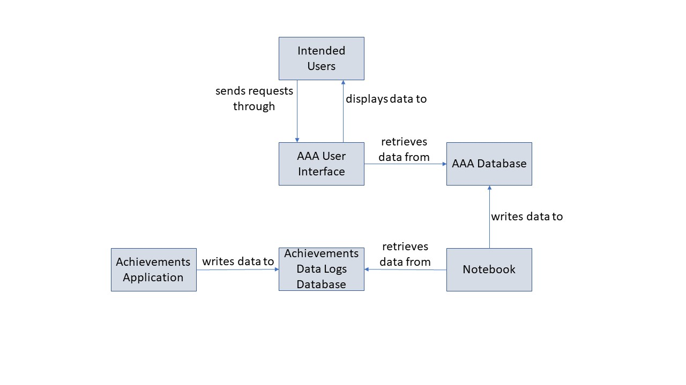
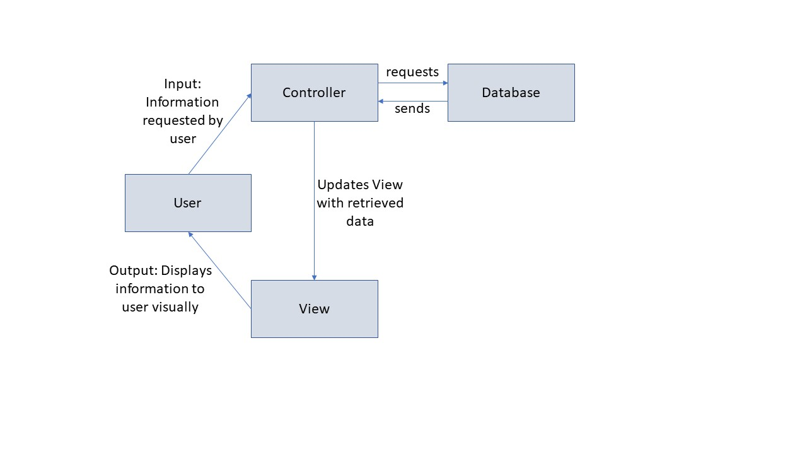

## Links & Instructions:
+ [Demo](https://bt3103project.firebaseapp.com/)

The application has a straight forward interface, with 4 different views for 4 different kinds of users.

Click on Student to look at statistics and charts targeted at students/learners of CodeCombat & Achievements 

Click on Course for to look at statistics and charts targeted at teachers/coordinators

Click on Cohort for to look at statistics and charts targeted at managers/coordinators

Click on Overall for to look at statistics and charts targeted at the developer of the Analytics Application or the overall coordinator of the National Coding Championships

+ [Video Walkthrough](https://www.youtube.com/watch?v=jotGKAv7Bks)

## ====================================================
# Documentation

## 1. Preface

This document is intended for all audiences of the AAA software, including users responsible for implementing, using or evaluating the software. The users include students, course administrators, cohort administrators and overall supervisors of the program. The purpose of this document is to provide information on the functionalities of the software, how the functionalities are implemented, and any other relevant information pertaining to the software. The information in this document is updated periodically to ensure its veracity on the last revised date, as new information become available or as decisions are made.

The document changelog is included in Appendix A, outlining the changes and revisions of each version.

## ====================================================

## 2. Software Concept
This section serves as an introduction to the concept behind the AAA software.
### 2.1 Motivation

The motivation behind our application stems from the increasing demand for data analytics software due to the large amounts of data logged by the Achievements application. The team saw an absence of software to carry out data analysis on the data logged as a result of user activity. This could result in unnecessary time spent analysing the data manually, or the loss of valuable insights that could be used to improve existing features of the Achievements application, enhancing its effectiveness.
## ---------------------------------------------------------------------------------
### 2.2 Objectives
The objective of the application is to carry out analysis of logged data, and presenting the results such as trends and statistical summaries to the intended audience of the AAA application. Additionally, the team hopes that the software is simple to use such that it has a high utilisation rate. This is the first software developed to analyse the Achievements application data, hence the analytics employed in the software are mainly descriptive in nature. After careful consideration of these objectives, the following software requirements were agreed upon.

**Software Requirements**
1. Primary Requirements
    * Weekly analysis of event logs
    * Weekly update of database
    * Display latest results of descriptive analytics through visual tools
    * Wait time to retrieve and display results does not exceed 10 seconds
    * Scalable database to match increasing number of users of Achievements application
    * Zero software display problems by week 13 implementation
    * Zero development and maintenance cost
    * Full implementation by week 13
2. Analytics Requirements
    * Provide statistical summaries and trends of logged data (Descriptive)
    * Propose models to explain trends exhibited by data (Diagnostic)
3. Secondary Requirements
    * User profile and only retrieve data that is relevant to user
    * Login authorisation to identify user
    * Intuitive software user interface
    * Display of results of predictive analytics
## ---------------------------------------------------------------------------------
### 2.3 User Personas
#### 2.3.1 Students

**Who are they?**
In the program, the students are the main subjects of the analysis. The students will be using both the Achievements application and CodeCombat. Through completing their designated assignments and completing levels on CodeCombat, data entries are registered in our database and these event logs will form the basis of analytics. The students are segmented by the school that they are in and the level at which they are at (junior or senior).

**What are they looking for?**
Students would be interested in knowing their overall progress and how they fair in comparison to other students in the course that they are in. 

**How does the application provide what they need?**
The analytics for the student view will allow students to view their progress in terms of the number of levels completed, their total playtime, and the number of achievements they have obtained. Medians of these statistics computed from all the students in the same course will be provided so that students can compare their statistics with the rest of the course. Additionally, students will be able to view levels that they have yet to complete and their playtime generated in each of the levels.

**Statistics provided**
CodeCombat
* Total Achievements
* Total Levels Completed
* Total Playtime
* Median Total Achievements for your Course
* Median Levels Completed for your Course
* Median Total Playtime for your Course
* List of Uncompleted Levels
* List of Levels Last Played
* Playtime for each Level Completed

#### 2.3.2 Course Coordinator
**Who are they?**
In the program, each course of students will have one or more course coordinators to oversee the course that their students are in. These course coordinators mainly come from the educational institutes that the students are enrolled in. 

**What are they looking for?**
Course Coordinators would be interested in knowing which levels students are confident in also which levels students are struggling with. Additionally, they would like to know which students are underperforming in the course and the recent user activity among students in their course.

**How does the application provide what they need?**
The analytics for the Course Coordinator view will allow Course Coordinators to have a clear picture of which levels students are struggling the most in and hence can intervene and clarify doubts in the respective areas. For example, by looking at the average playtime of completed levels where students are spending the most time on, coordinators can propose to having a live teaching session on the specific level to clarify doubts of students.

**Statistics provided**
* Number of Students Enrolled in the Course
* Median of CodeCombat Levels Completed in the Course
* Median of Total Playtime on CodeCombat
* Median of Total Achievements obtained on CodeCombat
* Top 10 Completed Levels with the highest playtime spent

#### 2.3.3 Cohort Coordinator
**Who are they?**
The Cohort Coordinators are individuals who oversee the courses in their specific cohort. The cohorts are namely the Primary, Junior and Senior cohorts for the National Coding Championships. 

**What are they looking for?**
Cohort Coordinators would be interested in knowing the statistics for the cohort that they are supervising so as to keep track of the progress of students in the National Coding Championships. 

**How does the application provide what they need?**
The analytics for the Cohort Coordinators will allow the respective Coordinators to view which courses in a specific cohort have low participation, and can seek to intervene, perhaps by sending a reminder email to the course coordinators.. The descriptive statistic help them decide the benchmark of performance in the competition and can help them re-evaluate the guidelines of the competition if the need arises.

**Statistics provided**
* Median of Users Total Achievements in Cohort
* Median of Total Levels Attempted in Cohort
* Median of Total Playtime 
* Median of Total Completed Playtime
* Median of Total Completed Levels 
* Number of Users in each Course for the specific Cohort

#### 2.3.4 Program Supervisor
**Who are they?**
The Program Supervisors are the people who are in charge of the whole program. These individuals will be provided with the overall view of the CodeCombat statistics, as well as the number of users on different platforms, including the Achievements Application.

**What are they looking for?**
The Program Supervisors will be interested in keeping track of the total number of users registered on the platform at any time. This is so that they can monitor the overall usage of CodeCombat. They will also be looking to track the number of users who are also users on other platforms like IVLE, Moodle so that they can evaluate the effectiveness of integrating the Achievements Application with these other platforms.

**How does the application provide what they need?**
By looking at the median statistics of most data available from CodeCombat, like the number of levels attempted and completed, the playtime spent on CodeCombat, the Program Supervisor is able to monitor the progress of the purpose behind CodeCombat, which is used for the Singapore National Coding Championships itself. For example, by looking at the Composed Chart of the top and bottom levels completed on CodeCombat, along with the average playtime spent on these levels, the Program Supervisor will be able to nitpick which levels are considered easy, or hard, so as to come up with the specifications of challenging levels to be included in the coding championships.

**Statistics provided**
* Number of Users on Different Platforms (IVLE, Achievements, CodeCombat, Moodle)
* Number of Users on Achievements for the different courses
* Median of Achievements, Levels Attempted, Total Playtime on CodeCombat.
* Top 20 Completed Levels on CodeCombat, along with their average playtime
* Top 20 Levels Attempted with Highest Average Playtime, along with their average playtime spent
* Top Uncompleted Levels across all Cohorts.

The analysis results are currently available to any users of the Achievements Analytics Application. There is currently no verification of the user implemented, though future plans are to migrate the Achievements Analytics Applications to be integrated in the Achievements application itself. The information presented through the AAA software is entirely factual and unbiased.
## ---------------------------------------------------------------------------------
### 2.4 Software Architecture

## ---------------------------------------------------------------------------------
### 2.5 Module Specifications
For our software, we are designing and implementing the ‘AAA User Interface’, ‘AAA Database’ and ‘Notebook’ modules.
#### 2.5.1 AAA User Interface
**Platform**: Web Application
**Implemented using**: React.js, JavaScript, HTML

**Requirements:**
* Display latest results of descriptive analytics through visual tools
* Wait time to retrieve and display results does not exceed 5 seconds
* Zero software display problems by week 13 implementation
* Zero development and maintenance cost

**Function:**
* Elicits information user wants to see
* Retrieve information from database
* Displays information through visual tools
* Displays information according to user persona.
* Enter CodeCombat user ID to retrieve charts instantly

**Features:**
* Navigation buttons to switch between the 4 views
* Ability to search for specific user progress on CodeCombat
* Compare user's progress with the rest of the course
* Quick integration with Achivements Application enabled with similar interface and developement template

**Module-View Controller**

#### 2.5.2 AAA Database
**Platform:** Firebase
**Implemented using:** Firebase

**Requirements:**
* Wait time to retrieve and display results does not exceed 10 seconds
* Scalable database to match increasing number of users of Achievements application
* Zero development and maintenance cost
* Stores data in ‘json’ data type

**Functions:**
* Stores data after analytics are conducted from Notebook

#### 2.5.3 Notebook
**Platform:** Colaboratory
**Implemented using:** Python

**Requirements:**
* Weekly descriptive analysis of event logs
* Weekly update of Firebase Realtime Database
* Read data in ‘json’ format
* Write data in ‘json’ format

**Functions:**
* Conducts the analysis of Achievement application logged data
* Updates the database with results of analysis

## ====================================================
## 3. Development Team
### 3.1 Individual Expertise
**Desmond Chay**
Has vital experience in project management. Experienced with Android Development, Python & Java language. Took a course on data visualization. Knowledgeable in predictive analytic techniques.

**Darius Yip**
He has an excellent background in coding as he has read advanced level modules in programming methodologies.

**Jasvinder Singh**
He is proficient in gathering data for research and using sophisticated tools to analyse data sets. Took a course in Decision Making Tools which imparts knowledge on analytics through data mining.
## ---------------------------------------------------------------------------------
### 3.2 Project Roles
**Project Manager**
Desmond Chay is responsible that all activities are synchronised in both the planning and execution phases of the project. Desmond will serve as the authority to make and cross-functional decision making or alteration of plans. Desmond will overlook all processes in the development process and will ensure that the activities strictly follow the guidelines outlined in the planning phase.

**Requirements Engineering**
Jasvinder Singh is responsible for providing technical clarifications of the requirements. Jasvinder will facilitate the process of requirements analysis initially and will be in charge of updating requirements through each iteration of the development cycle. Procedures of gathering insights from users of the application to generate and update requirements will be lead by Jasvinder.

**Software Engineer**
Darius Yip is responsible for the technical processes of our project. All coding and web design will be handled by Darius. He will be in charge of the design of our application and the retrieval of data from the achievement logs and will be conducting the necessary data analytics tasks. Darius will be involved in deciding the best way of data presentation in order to meet the needs of the coordinators by converting requirements into practical presentable solutions to the application users.
## ====================================================
## 4. Development Process

For the AAA software, we would be using the ‘Agile’ development model. The purpose of the AAA software is to provide a platform for descriptive analytics of the logged data. All the proposed modules are essential to achieving our intended purpose. As such, the development of the software would be decomposed into several iterations, with each iteration dedicated to one module. Each iteration is expected to last from 1 to 2 weeks time.

A chronological order of our development process is as follows:

Before the first iteration begins, the requirements of the software and module specifications would have already been agreed on. At this stage, the resources required for implementation would be prepared, along with the familiarisation of any software or programming languages required for development.

The first iteration begins, starting with the ‘AAA user interface’ module. The first phase of an iteration begins with a review of the module requirement, revising, removing or adding any requirements if necessary. The next phase would include designing the module and specify how the features of the module should be implemented. The implementation of the module begins and once it is done, testing would be conducted. The user test cases are formulated using the intended audience of the AAA application as the main user. The iteration would end with the deployment of implemented features.

The iterations for the other two modules are conducted in a similar fashion. However, each iteration builds upon the previous build, which results in an increment of the number of functional features the software has.

Upon completion of all iterations, a final round of extensive testing would be conducted before final and official release of the AAA software.

## ====================================================
## 5. Software Development Log

| DATE | LOG |
| ------ | ------ |
| 5th Feb | Initial software requirements were decided on |
| 10th Feb | Revision of software requirements Designed software architecture and software specifications|
| 13th Feb | Design of software paper prototype |
| 20th Feb | Design of software prototype |
| 22nd Feb | Procurement of resources for software development |
| 24th-26th Feb | Familiarisation of resources for AAA software development |
| 1st March | First iteration begins - ‘AAA user interface’ module |
| 11th March  | Deployed AAA user interface model |
| 16th April | Added search functionality for user view |
| 17th April | Selection of specific course/cohort allowed |
| 18th April | Added more charts into AAA |
| 19th April | Application Deployed on Firebase |

## ====================================================
